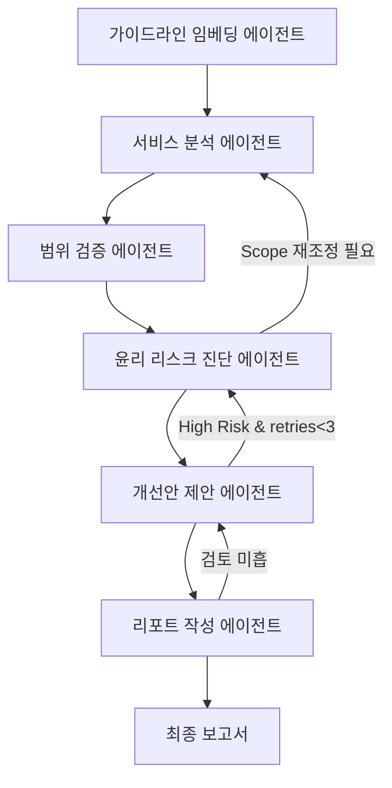

# AI 윤리성 리스크 진단 멀티에이전트 설계 시나리오
- 본 프로젝트는 AI 서비스의 윤리적 리스크(편향성, 프라이버시 침해, 투명성 부족 등)를 진단하고, 개선 권고안을 자동으로 도출하는 멀티에이전트 시스템을 설계·구현한 실습 프로젝트입니다.

## Overview
- Objective : 특정 AI 서비스(최대 3개)에 대해 국제적 윤리 가이드라인을 기반한 윤리 리스크 진단·개선 자동화  
- Ethics Guidelines Priority:  
  1) UNESCO AI Ethics Recommendations  
  2) OECD AI Principles  

- Methods : 멀티에이전트 협력 평가, 자율점검표 기반 리스크 분석, 보고서 자동 생성  
- Tools : LangGraph, LangChain, Python, GPT-4o-mini(OpenAI API), Chroma  

## Features
- AI 서비스별 윤리 리스크(편향, 프라이버시, 설명가능성 등) 자동 진단  
- 국제 가이드라인 기반 자율점검표 적용 및 리스크 등급화  
- 개선 권고안 및 요약 보고서 자동 생성  
- 진단 범위 검증 및 업데이트: 사전 임베딩된 데이터와 대조하여 진단 범위를 최신 정보로 갱신  
- 텍스트 저장 최적화: 모든 (대용량)텍스트는 ChromaDB에 저장하고, State에는 해당 문서 참조 메타데이터만 기록  

## Tech Stack 
| Category   | Details                                                |
|------------|--------------------------------------------------------|
| Framework  | LangGraph, LangChain, Python                           |
| LLM        | GPT-4o-mini via OpenAI API                             |
| Vector DB  | ChromaDB                                               |
| Embedding  | HuggingFace (nlpai-lab/KURE-v1)                        |
| Data       | PDF OCR(PyMuPDFLoader), Web Search(Tavily)             |

## Agents
| 에이전트명                | 주요 역할 및 설명                                                                               |
|---------------------------|-------------------------------------------------------------------------------------------------|
| 가이드라인 임베딩 에이전트 | 국제적 윤리 가이드라인(UNESCO, OECD) 문서 임베딩 상태 확인 및 필요시 자동 임베딩 수행           |
| 서비스 분석 에이전트       | AI 서비스 개요, 대상 기능, 주요 특징 등 정리 및 진단 범위 확정                                 |
| 범위 검증 에이전트         | 서비스 분석 에이전트가 확정한 진단 범위를 사전 임베딩된 데이터와 대조하여 관련 정보 검증·수정  |
| 윤리 리스크 진단 에이전트  | 공정성, 프라이버시, 투명성, 책임성, 안전성 등 5대 윤리 차원별 리스크 평가 |
| 개선안 제안 에이전트       | 리스크 완화 및 윤리성 강화 위한 구체적 개선 방향 도출                                          |
| 리포트 작성 에이전트       | 진단 결과 및 권고사항 요약 보고서 자동 생성                                                    |

### 가이드라인 임베딩 에이전트
| 노드명               | 입력(State 필드)                    | 출력(State 필드)                       | 상세 프롬프트 예시                                                                                                                            |
|----------------------|-------------------------------------|----------------------------------------|----------------------------------------------------------------------------------------------------------------------------------------------|
| EmbeddingChecker     | -                                   | `embedded_files`, `need_embedding`     | 시스템: 당신은 문서 임베딩 전문가입니다.<br>벡터 데이터베이스에서 국제적 윤리 가이드라인 문서(UNESCO, OECD)의 임베딩 상태를 확인하고, 임베딩이 필요한 파일 목록을 반환하세요. |
| GuidelineEmbedder    | `need_embedding`                    | `embedded_files`, `embedding_status`   | 시스템: 당신은 문서 임베딩 전문가입니다.<br>지정된 윤리 가이드라인 문서(`{files}`)를 임베딩하고, 각 파일의 임베딩 상태를 보고하세요. |

### 윤리 리스크 진단 에이전트
- 입력(State): `SERVICE_INFO.summary`, `SCOPE_UPDATE.modifications`, `ETHICS_GUIDELINE.guideline_list`  
- 5대 윤리 차원 평가지침  
  • 국제 윤리 가이드라인 기반 5가지 핵심 차원 정의  
    1) 공정성(Fairness): 성별·연령·장애·지역·인종·종교 등 개인 특성에 따른 편향과 차별 최소화
       - 1점: 편향 여부 평가 프로세스 전혀 없음
       - 5점: 데이터·모델 평가 시 주요 집단 간 성능 차이 2% 미만
    2) 프라이버시(Privacy): 개인정보 보호를 위한 사전 프라이버시 영향평가(PIA) 및 암호화·익명화 조치 적용
       - 1점: PIA 미실시 및 비식별화 절차 부재
       - 5점: 전수 PIA 수행 및 암호화·접근 통제 체계 완전 구축
    3) 투명성(Transparency): 의사결정 근거와 처리 과정을 이해관계자가 확인할 수 있는 설명 가능성 보장
       - 1점: 결과의 근거를 전혀 제공하지 않음
       - 5점: 모델 로직·데이터 출처 문서화로 사용자 질의 응답 가능
    4) 책임성(Accountability): 윤리적 문제에 대한 책임 부담 및 독립 감사·보고 체계 마련
       - 1점: 책임 주체 및 절차 전무
       - 5점: 정기적 윤리영향평가·외부 감사를 통한 거버넌스 완전 작동
    5) 안전성(Safety & Robustness): 예기치 않은 오류·공격으로부터 안정성 유지를 위한 취약점 분석과 대응 절차 구축
       - 1점: 취약점 진단·모니터링 전무
       - 5점: 위협 시나리오 테스트, 실시간 모니터링, 자동 대응 체계 완비
  • 1–5점 척도를 각 차원별로 구체적 기준과 함께 정의  
  • 평가 기반: 데이터 훈련/테스트 과정, 모델 구현, 서비스 운영, 거버넌스 체계 전반 포함

| 노드명               | 입력(State 필드)                                       | 출력(State 필드)                         | 상세 프롬프트 예시                                                                                                                                                                                                                                                   |
|----------------------|--------------------------------------------------------|------------------------------------------|---------------------------------------------------------------------------------------------------------------------------------------------------------------------------------------------------------------------------------------------------------------------|
| GuidelineRetriever   | `ETHICS_GUIDELINE.doc_id`                             | `guideline_summary`                      | 시스템: 5대 윤리 차원(공정성, 프라이버시, 투명성, 책임성, 안전성)에 따라 주요 평가 기준을 요약하고, 각 차원의 1-5점 척도를 표로 작성하세요.                                                                                                                          |
| RiskItemExtractor    | `SERVICE_INFO.summary`, `SCOPE_UPDATE.modifications`  | `risk_items` (list)                      | 시스템: 5대 윤리 차원 기준으로 **5~7개** 잠재 리스크 항목을 추출하고, 각 항목이 어느 차원(공정성/프라이버시/투명성/책임성/안전성)에 해당하는지 표시하세요.                                                                                                                   |
| ScorePredictor       | `risk_items`, `guideline_summary`                      | `scores`, `rationale`                  | 시스템: 각 리스크 항목에 대해 해당 차원의 1~5점 척도에 따라 점수를 평가하고, 2문장 이내 근거를 작성하세요. 적용 가이드라인 요약: `{guideline_summary}`                                                                                                                              |
| ScoreCalculator      | `scores`                                           | `risk_scores.basic`, `risk_scores.weighted` | 시스템: 기본(basic = 점수 평균)과 가중합(weighted = 공정성×0.25 + 프라이버시×0.25 + 투명성×0.2 + 책임성×0.15 + 안전성×0.15)을 계산하세요.                                                                                                                                                |
| SeverityClassifier   | `risk_scores.weighted`                                 | `severity_levels`                        | 시스템: weighted 점수를 1–2:'낮음', 2.1–3:'중간', 3.1–4:'높음', 4.1–5:'심각'으로 분류하고, JSON `{"level":"등급","thresholds":[1–2,2.1–3,3.1–4,4.1–5]}` 형식으로 출력하세요.                                                                                                           |
| LoopController       | `severity_levels`, `RISK_ASSESSMENT.retry_count`       | `next_node`, `retry_count`               | 시스템: `retry_count`<3이고 '높음'/'심각' 등급 존재 시 `next_node="ScorePredictor"`, 재진단; 그렇지 않으면 `next_node="ImprovementAgent"`로 이동하세요.                                                                                                                     |

## State
- GUIDELINE_EMBEDDING: 윤리 가이드라인 임베딩 상태 정보
  - embedded_files: 임베딩 완료된 가이드라인 파일 목록
  - embedding_status: 임베딩 상태 ('completed', 'failed', 'skipped')
  - timestamp: 최근 임베딩 수행 시간
- SERVICE_INFO: 진단 대상 AI 서비스 개요 및 주요 기능 정보 
  - doc_id: 서비스 개요 문서 고유 식별자  
  - chunk_ids: 분할 청크 ID 목록  
  - summary: 서비스 개요 요약문  
- SCOPE_UPDATE: 검증 에이전트가 수정·확인한 진단 범위 정보  
  - doc_id: 진단 범위 검증 문서 ID  
  - modifications: 수정·확인된 범위 항목 메타 정보  
- ETHICS_GUIDELINE: 적용할 윤리 가이드라인 및 기준 목록  
  - doc_id: 가이드라인 원문 ID  
  - guideline_list: 조항 번호, 제목 등 메타  
- RISK_ASSESSMENT:  
  - doc_id: 리스크 평가 원문 ID  
  - risk_items: 항목별 리스크 리스트  
  - scores: 공정성, 프라이버시, 투명성, 책임성, 안전성, rationale  
  - risk_scores: basic, weighted  
  - severity_levels: `[{ "item_id":..., "level":"..." }, ...]`  
  - retry_count: 재진단 시도 횟수  
  - next_node: `"ScorePredictor"` 또는 `"ImprovementAgent"`  
- IMPROVEMENT_SUGGESTION:  
  - doc_id: 개선안 제안 원문 ID  
  - suggestions: 각 리스크별 개선 권고 메타 정보  
- REPORT:  
  - doc_id: 최종 보고서 원문 ID  
  - outline: 보고서 목차 메타데이터


## Architecture

- 각 에이전트는 독립적으로 작동하며, 상위 결과를 입력받아 다음 단계로 전달
- RAG 기반 문서 검색 시 최대 2개 문서·30p 이내 범위에서 ChromaDB를 통해 최신 가이드라인·사례 로드

## Directory Structure
```
├── data/ # AI 서비스 관련 원문 문서 및 가이드라인
├── agents/ # 멀티에이전트 모듈 (서비스 분석, 범위 검증, 윤리 진단, 개선안, 리포트)
├── prompts/ # 프롬프트 템플릿
├── schemas/ # JSON 메시지 스키마 정의
├── outputs/ # 보고서 참조 메타데이터 저장
├── vector_store/ # ChromaDB 설정 및 스키마 정의
├── app.py # 실행 스크립트
└── README.md

```

## 보고서 정의(예시 프롬프트)
```
SUMMARY
- 진단 대상 서비스 및 주요 기능 요약 (ChromaDB doc_id로 조회)
- 적용 윤리 가이드라인 및 평가 항목 (메타데이터 기반)
- 핵심 리스크 진단 결과 요약(편향, 프라이버시, 투명성 등)
- 주요 개선 권고안 요약
1. 서비스 개요 및 진단 목적
2. 적용 윤리 가이드라인(출처, 주요 기준)
3. 항목별 윤리 리스크 평가 결과
  - 공정성(Fairness): 위험 등급, 근거(메타데이터)
  - 프라이버시(Privacy): 위험 등급, 근거(메타데이터)
  - 투명성(Transparency): 위험 등급, 근거(메타데이터)
  - 책임성(Accountability): 위험 등급, 근거(메타데이터)
  - 안전성(Safety & Robustness): 위험 등급, 근거(메타데이터)
4. 리스크별 개선 권고안
5. 결론 및 향후 과제
```


## 설계 방향성 및 시나리오 요약
- 국제 기준 준수: EU AI Act, UNESCO, OECD 등 국제적 윤리 가이드라인을 진단 프레임워크에 명확히 반영  
- 자율점검표 활용: 국내외 AI 윤리 자율점검표를 참고하여, 서비스 특성에 맞는 문항을 자동 선별·적용  
- 진단 범위 검증·업데이트: 사전 임베딩된 데이터와 대조하여 범위 누락·변경 사항을 자동 반영  
- 리스크 등급화: 위험 등급(낮음/중간/높음/심각) 및 근거를 명확히 산출, 개선 전·후 효과 추적  
- 개선안 자동화: 각 리스크별로 구체적 개선 방향 및 실행 방안을 제안  
- 투명성·책임성 강화: 모든 진단 과정과 결과를 투명하게 보고서에 기록, 피드백 및 외부 전문가 평가 연계  
- 확장성: 최대 3개 서비스 동시 진단, RAG 적용 문서 제한 및 키워드 가중치 기반 동적 검색  

## Contributors 
- 이원행
