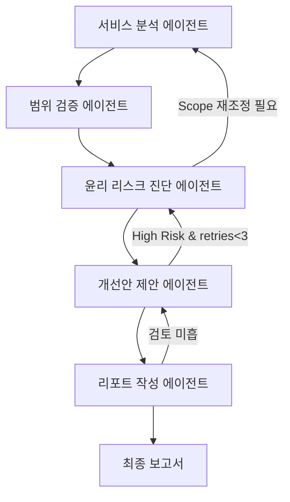

# AI 윤리성 리스크 진단 멀티에이전트 설계 시나리오
- 본 프로젝트는 AI 서비스의 윤리적 리스크(편향성, 프라이버시 침해, 투명성 부족 등)를 진단하고, 개선 권고안을 자동으로 도출하는 멀티에이전트 시스템을 설계·구현한 실습 프로젝트입니다.

## Overview
- Objective : 특정 AI 서비스(최대 3개)에 대해 국제적 윤리 가이드라인을 기반한 윤리 리스크 진단·개선 자동화  
- Ethics Guidelines Priority:  
  1) EU AI Act  
  2) UNESCO AI Ethics Recommendations  
  3) OECD AI Principles  
  4) 기타(ISO, 국내 자율점검표)  
- Methods : 멀티에이전트 협력 평가, 자율점검표 기반 리스크 분석, 보고서 자동 생성  
- Tools : LangGraph, LangChain, Python, GPT-4o-mini(OpenAI API), Chroma  

## Features
- AI 서비스별 윤리 리스크(편향, 프라이버시, 설명가능성 등) 자동 진단  
- 국제 가이드라인 기반 자율점검표 적용 및 리스크 등급화  
- 개선 권고안 및 요약 보고서 자동 생성  
- 진단 범위 검증 및 업데이트: 사전 임베딩된 데이터와 대조하여 진단 범위를 최신 정보로 갱신  
- 텍스트 저장 최적화: 모든 (대용량)텍스트는 ChromaDB에 저장하고, State에는 해당 문서 참조 메타데이터만 기록  

## Tech Stack 
| Category   | Details                                                |
|------------|--------------------------------------------------------|
| Framework  | LangGraph, LangChain, Python                           |
| LLM        | GPT-4o-mini via OpenAI API                             |
| Vector DB  | ChromaDB                                               |
| Embedding  | HuggingFace (nlpai-lab/KURE-v1)                        |
| Data       | PDF OCR(PyMuPDFLoader), Web Search(Tavily)             |

## Agents
| 에이전트명                | 주요 역할 및 설명                                                                               |
|---------------------------|-------------------------------------------------------------------------------------------------|
| 서비스 분석 에이전트       | AI 서비스 개요, 대상 기능, 주요 특징 등 정리 및 진단 범위 확정                                 |
| 범위 검증 에이전트         | 서비스 분석 에이전트가 확정한 진단 범위를 사전 임베딩된 데이터와 대조하여 관련 정보 검증·수정  |
| 윤리 리스크 진단 에이전트  | 편향성, 개인정보, 설명가능성 등 윤리 기준별 리스크 평가                                        |
| 개선안 제안 에이전트       | 리스크 완화 및 윤리성 강화 위한 구체적 개선 방향 도출                                          |
| 리포트 작성 에이전트       | 진단 결과 및 권고사항 요약 보고서 자동 생성                                                    |

### 윤리 리스크 진단 에이전트
| 노드명               | 입력(State 필드)                                       | 출력(State 필드)                         | 상세 프롬프트 예시                                                                                                                                                                                                                                                   |
|----------------------|--------------------------------------------------------|------------------------------------------|---------------------------------------------------------------------------------------------------------------------------------------------------------------------------------------------------------------------------------------------------------------------|
| GuidelineRetriever   | `ETHICS_GUIDELINE.doc_id`                             | `guideline_summary`                      | 시스템: 당신은 AI 윤리 가이드라인 전문가입니다.<br>입력된 문서 ID(`{doc_id}`)에 해당하는 가이드라인에서 **편향성**, **프라이버시**, **투명성** 관련 조항을 우선순위(EU AI Act > UNESCO > OECD > 기타)에 따라 요약하되, 조항 번호와 제목을 포함해 표로 작성하세요.      |
| RiskItemExtractor    | `SERVICE_INFO.summary`, `SCOPE_UPDATE`                | `risk_items` (list)                      | 시스템: 당신은 AI 서비스 윤리 평가 전문가입니다.<br>서비스 요약과 검증된 범위 정보를 바탕으로 **편향성**, **프라이버시**, **설명가능성** 등 주요 윤리 항목별로 잠재 리스크 항목을 **5~7개**씩 추출하고, 간단한 설명을 덧붙여 리스트 형태로 출력하세요.            |
| ScorePredictor       | `risk_item`, `guideline_summary`                      | `P, S, D, M, rationale`                  | 시스템: 다음 항목 `'{item}'`의 윤리 리스크를 평가하세요.<br>1) 발생 가능성(P), 2) 심각도(S), 3) 탐지 용이성(D), 4) 완화 난이도(M)을 각각 **1~5점**으로 산정하고, 각 점수에 대한 근거를 **2문장 이내**로 설명하세요.<br>적용 가이드라인 요약은 다음과 같습니다:<br>`{guideline_summary}` |
| ScoreCalculator      | `P, S, D, M`                                           | `risk_scores.basic`, `risk_scores.weighted` | 시스템: 입력된 점수 P=`{P}`, S=`{S}`, D=`{D}`, M=`{M}`에 대해<br>1) 기본(basic): `basic = P × S`<br>2) 가중합(weighted): `weighted = 0.4×P + 0.4×S + 0.1×D + 0.1×M`<br>두 결과를 모두 반환하세요. |
| SeverityClassifier   | `risk_scores.weighted`                                 | `severity_level`                         | 시스템: 가중합 점수 `{weighted}`에 따라 다음 기준으로 등급을 결정하세요.<br>1–6: `'낮음'`, 7–12: `'중간'`, 13–18: `'높음'`, 19–25: `'심각'`<br>결과를 `{"level":"등급","thresholds":[1–6,7–12,13–18,19–25]}` 형식의 JSON으로 출력하세요. |
| LoopController       | `severity_levels`, `retry_count`              | `next_node`, `retry_count`               | 시스템: 1) 현재 `retry_count` < 3이고 `'높음'` 또는 `'심각'` 등급이 있으면 `next_node="ScorePredictor"`, `retry_count++`.<br>2) `retry_count` ≥ 3이거나 모든 항목 `'중간'` 이하일 경우 `next_node="ImprovementAgent"`로 이동하세요.<br>현재 등급 리스트: `{severity_list}`, 재진단 시도: `{retry_count}`회 |

## State
- SERVICE_INFO: 진단 대상 AI 서비스 개요 및 주요 기능 정보  
  - doc_id: 서비스 개요 문서 고유 식별자  
  - chunk_ids: 분할 청크 ID 목록  
  - summary: 서비스 개요 요약문  
- SCOPE_UPDATE: 검증 에이전트가 수정·확인한 진단 범위 정보  
  - doc_id: 진단 범위 검증 문서 ID  
  - modifications: 수정·확인된 범위 항목 메타 정보  
- ETHICS_GUIDELINE: 적용할 윤리 가이드라인 및 기준 목록  
  - doc_id: 가이드라인 원문 ID  
  - guideline_list: 조항 번호, 제목 등 메타  
- RISK_ASSESSMENT:  
  - doc_id: 리스크 평가 원문 ID  
  - risk_items: 항목별 리스크 리스트  
  - scores: P, S, D, M, rationale  
  - risk_scores: basic, weighted  
  - severity_levels: `[{ "item_id":..., "level":"..." }, ...]`  
  - retry_count: 재진단 시도 횟수  
  - next_node: `"ScorePredictor"` 또는 `"ImprovementAgent"`  
- IMPROVEMENT_SUGGESTION:  
  - doc_id: 개선안 제안 원문 ID  
  - suggestions: 각 리스크별 개선 권고 메타 정보  
- REPORT:  
  - doc_id: 최종 보고서 원문 ID  
  - outline: 보고서 목차 메타데이터

## Architecture

- 각 에이전트는 독립적으로 작동하며, 상위 결과를 입력받아 다음 단계로 전달
- RAG 기반 문서 검색 시 최대 2개 문서·30p 이내 범위에서 ChromaDB를 통해 최신 가이드라인·사례 로드

## Directory Structure
```
├── data/ # AI 서비스 관련 원문 문서 및 가이드라인
├── agents/ # 멀티에이전트 모듈 (서비스 분석, 범위 검증, 윤리 진단, 개선안, 리포트)
├── prompts/ # 프롬프트 템플릿
├── schemas/ # JSON 메시지 스키마 정의
├── outputs/ # 보고서 참조 메타데이터 저장
├── vector_store/ # ChromaDB 설정 및 스키마 정의
├── app.py # 실행 스크립트
└── README.md

```

## 보고서 정의(예시 프롬프트)
```
SUMMARY
- 진단 대상 서비스 및 주요 기능 요약 (ChromaDB doc_id로 조회)
- 적용 윤리 가이드라인 및 평가 항목 (메타데이터 기반)
- 핵심 리스크 진단 결과 요약(편향, 프라이버시, 투명성 등)
- 주요 개선 권고안 요약
1. 서비스 개요 및 진단 목적
2. 적용 윤리 가이드라인(출처, 주요 기준)
3. 항목별 윤리 리스크 평가 결과
  - 편향성: 위험 등급, 근거(메타데이터)
  - 프라이버시: 위험 등급, 근거(메타데이터)
  - 설명가능성: 위험 등급, 근거(메타데이터)
  - (기타 항목)
4. 리스크별 개선 권고안
5. 결론 및 향후 과제
```


## 설계 방향성 및 시나리오 요약
- 국제 기준 준수: EU AI Act, UNESCO, OECD 등 국제적 윤리 가이드라인을 진단 프레임워크에 명확히 반영  
- 자율점검표 활용: 국내외 AI 윤리 자율점검표를 참고하여, 서비스 특성에 맞는 문항을 자동 선별·적용  
- 진단 범위 검증·업데이트: 사전 임베딩된 데이터와 대조하여 범위 누락·변경 사항을 자동 반영  
- 리스크 등급화: 위험 등급(낮음/중간/높음/심각) 및 근거를 명확히 산출, 개선 전·후 효과 추적  
- 개선안 자동화: 각 리스크별로 구체적 개선 방향 및 실행 방안을 제안  
- 투명성·책임성 강화: 모든 진단 과정과 결과를 투명하게 보고서에 기록, 피드백 및 외부 전문가 평가 연계  
- 확장성: 최대 3개 서비스 동시 진단, RAG 적용 문서 제한 및 키워드 가중치 기반 동적 검색  

## Contributors 
- 이원행
